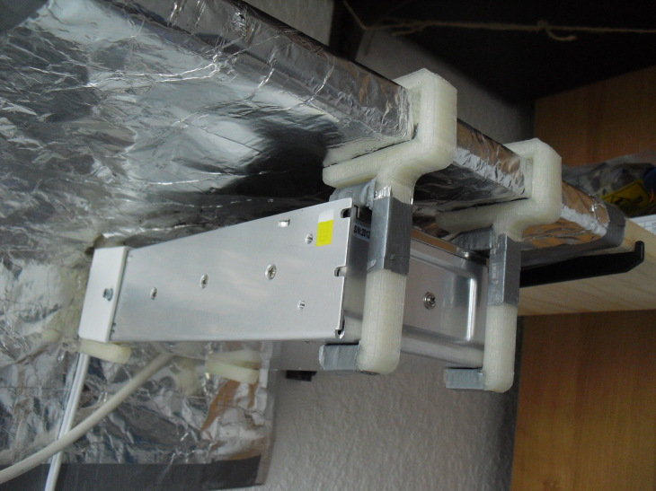
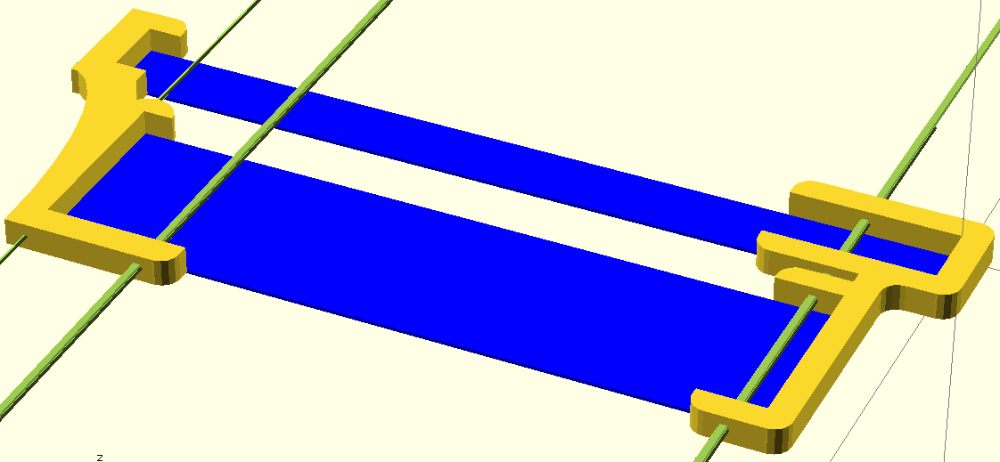

# Power supply holder
Holds a power supply (or a similar shaped box) to a wall. Obviously you *dont*
want it to fall! Make sure it is secure!(your safety is your responsibility)

You'll have to fit it to your situation. Which is why i havent provided the
`.stl`. To be honest, this is quite involved.

`pl`, `pt` are the plank length and width respectively. 

If it is a general box, `psl`, is the length. `pshf` and `pshb` are the height
front and back, not 100% if that works you could just set them the same.

`wd` is the distance you have between the plank and the wall.

`dx`,`dz` are respectively the distance of the box from the wall and plank.

You can use tape when it is too big. And a file to make it bigger if too small.
In some cases double-sided tape may help too.

I got the location of the screws wrong! `sfd` and `sbd` are supposed to be 
respectively the distance of the screw holes from the back and front.

One publish in [thingiverse](http://www.thingiverse.com/thing:77856).
